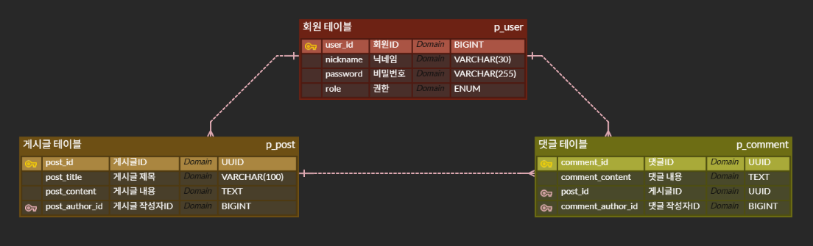

# 🛡️ 인증인가 게시판

**인증인가 게시판**은 회원 가입, 로그인, 권한 인증 기능이 포함된 기본 게시판 서비스입니다.  
회원은 게시글과 댓글을 작성할 수 있으며, 각 기능은 명확한 역할 분리를 통해 설계되었습니다.

> - **회원(User)** 은 여러 개의 게시글 및 댓글을 작성할 수 있습니다.
> - **게시글(Post)** 은 여러 개의 댓글을 가질 수 있습니다.
> - 모든 관계는 **1:N 구조**로 설계되었습니다.

 

## 📌 ERD

 

## 🛠️ 사용 기술 스택

### 🖥️ Language

  
  

### 🖥️ Framework

  
  
  

### 🗄️ Database & Infra

  

### 🔐 Auth

  

### ⚙️ Dev Tools

  

